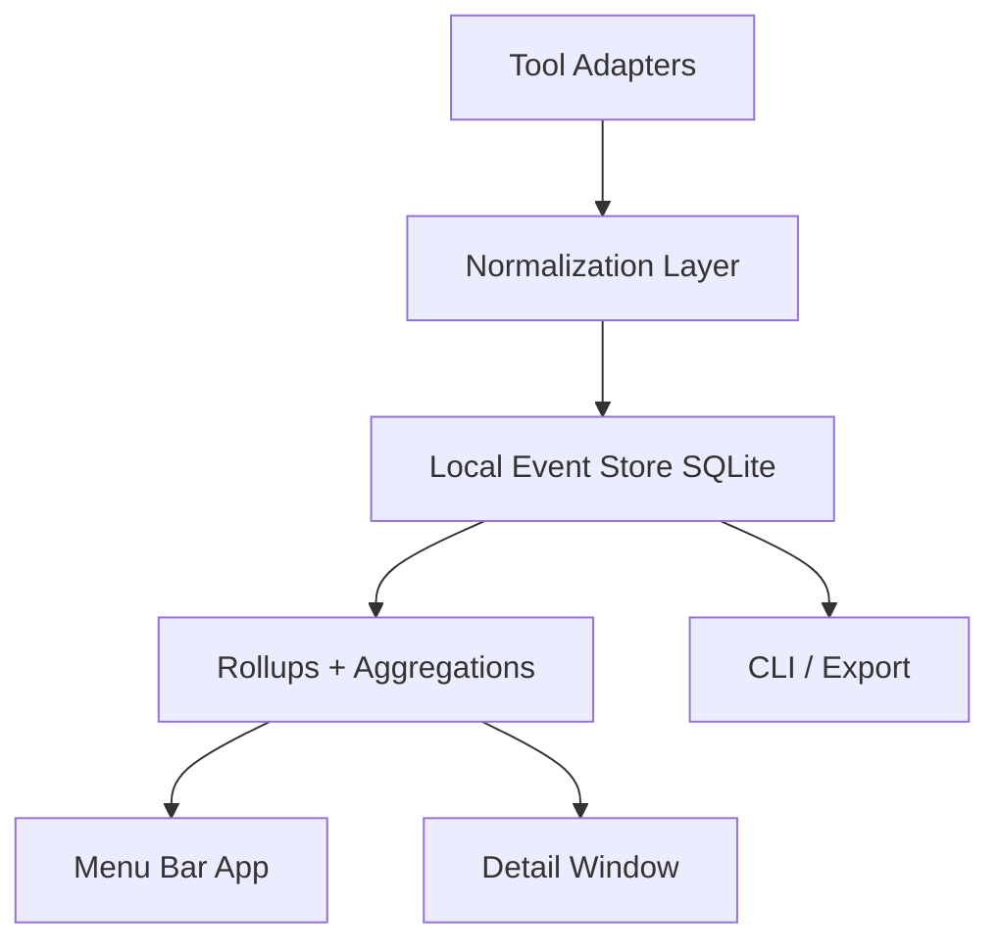

# TokenBar — Product + Technical Spec

## 1. Product thesis

TokenBar is a local-first macOS menu bar utility that helps people who use LLMs all day see their token usage and cost instantly, across tools where telemetry is available. [cite:1][page:5]  
The product should be AI-agnostic in positioning, but honest in implementation: it shows **exact** numbers where a tool exposes official request-level telemetry, **derived** numbers where usage can be inferred reliably, and **estimated/unavailable** where the platform does not expose enough data. [page:5][page:4][web:15]

The core promise is simple: from the menu bar, a user can immediately see “how much have I used today?” in tokens or money, then click into a richer view with rollups, trends, sessions, filters, and charts. [cite:1]  
The product should be built as a polished native Mac utility, not as a cloud dashboard. [cite:1][page:3]

---

## 2. Why this should exist

There is clear demand for lightweight visibility into AI coding usage, because community extensions already exist for Cursor usage and spend tracking, and Claude Code users are already building dashboards on top of its telemetry. [web:9][web:12][web:51][web:54]  
At the same time, there does not appear to be one mature product that gives exact, unified token visibility across Cursor, Claude Desktop, and Claude Code in a single polished interface. [page:5][page:4][web:15]

That gap creates an opportunity for a small utility product.  
The value is not raw token parsing alone; the value is a trustworthy, daily-use interface that makes fragmented usage data understandable in seconds. [page:5][web:47][web:54]

---

## 3. Product principles

- Local-first by default.
- No cloud account required for MVP.
- AI-agnostic positioning.
- Native macOS experience.
- Clear confidence labels on every metric.
- Privacy-first collection, with prompt content off by default.
- Sell polish, trust, and convenience; open-source the plumbing.

These principles fit the use case well because the user need is frequent, operational, and personal rather than collaborative or enterprise-first. [cite:1]  
They also fit the current telemetry landscape, where some providers expose strong data and others do not. [page:5][page:4][web:15]

---

## 4. User problem

People who use LLMs constantly across IDEs, terminals, web apps, and desktop apps often do not know how many tokens they are consuming, how that maps to spend, or which workflow is actually expensive. [cite:1][page:5]  
They may see some usage dashboards inside individual tools, but those views are fragmented and often inconsistent across products. [web:9][web:12][web:15]

The user wants:
- one glanceable daily number,
- the ability to switch between tokens and monetary equivalents,
- a running total over selectable periods,
- rollups across tools where possible,
- a local utility that stays out of the way. [cite:1]

---

## 5. Goals

### MVP goals

- Show a live menu bar summary for today’s usage.
- Allow toggling between tokens and money.
- Show drill-down charts for today, 7d, 30d.
- Support at least one exact integration at launch.
- Support one or more secondary derived integrations if stable enough.
- Export local data to CSV/JSON.
- Make data quality visible with labels like Exact / Derived / Estimated.

### Non-goals for MVP

- Cloud sync.
- Team dashboards.
- Cross-platform support.
- “Perfect” coverage of every AI interface.
- Billing reconciliation as an accounting-grade feature.

These boundaries are important because Claude Code has strong official telemetry support today, while Cursor is more workaround-driven and Claude Desktop does not appear to expose equivalent official token telemetry. [page:5][page:4][web:15]

---

## 6. Technical feasibility

### Feasibility summary

This product is feasible today, but not all integrations are equally strong. [page:5][page:4]  
Claude Code is the anchor integration because it officially supports OpenTelemetry-based monitoring with usage, token, cost, session, and request metadata. [page:5]  
Cursor is feasible as a secondary source because community tools already track usage/spend through local/session/dashboard mechanisms, but that path is less durable than official telemetry. [web:9][web:12][page:4]  
Claude Desktop should not be treated as a first-class exact source in MVP because there is no clear official equivalent for exact token telemetry. [web:15][page:5]

### Source support matrix

| Source | Access path | Fidelity | MVP stance |
|---|---|---|---|
| Claude Code CLI | Official OpenTelemetry metrics/events, including token and cost fields. [page:5] | Exact or near-exact at request level. [page:5] | Launch integration. |
| Cursor IDE | Community tools show tracking via dashboard/session/local data. [web:9][web:12][web:51][page:4] | Derived, sometimes reliable, but subject to breakage. [page:4] | Experimental or secondary launch integration. |
| Claude Desktop | No clear official token telemetry found. [web:15][page:5] | Estimated or unavailable. [web:15] | Do not promise in MVP. |
| Future AI tools | Adapter-specific. | Depends on source. | Add via plug-in model. |

### Important constraint

The product should never claim “exact tokens everywhere.” [page:5][web:15]  
The correct product language is: exact where officially exposed, derived where inferable, unavailable where not supported. [page:5][page:4][web:15]

---

## 7. Recommended 2026 stack

### App layer

- Swift 6
- SwiftUI
- `MenuBarExtra` for the menu bar utility
- AppKit bridging where needed for popovers, activation policy, menu sizing, and window behavior

Apple’s `MenuBarExtra` is explicitly intended for commonly used utility functionality that remains available even when the app is not active, which maps directly to this product. [web:65]  
A native Mac stack is a better fit than a cross-platform shell because the product is fundamentally a menu-bar-first utility whose value depends on native feel and OS integration. [web:65][cite:1]

### Data/storage layer

- SQLite for local event storage and rollups
- Lightweight migration system
- Background aggregation jobs
- CSV/JSON export

### Collector layer

- Local collector daemon or bundled helper process
- Plug-in adapter architecture
- Normalization layer that maps all sources into one event schema
- Confidence labeling at ingestion time

### Updates/distribution

- Direct distribution outside the Mac App Store
- Developer ID signing
- Notarization
- Sparkle for in-app updates

Apple supports distributing macOS software outside the Mac App Store, and Sparkle is a widely used open-source framework for macOS software updates. [page:3][page:6][web:63]

### Why not Tauri/Electron for MVP

Tauri 2 does support system tray functionality, so it is technically possible. [page:7]  
However, this app’s differentiator is native macOS polish rather than cross-platform reach, and recent tray-related issues reported in Tauri make it a less attractive starting point for a tray-first commercial utility. [page:7][web:70]  
Electron would also be overkill for a local menu bar utility and would likely make power usage, startup time, and native feel worse.

---

## 8. High-level architecture




### Components

#### 8.1 Native macOS app

Responsibilities:

- Menu bar pill
- Popover/dropdown
- Detail window
- Settings
- Onboarding
- Charts
- Alerts
- Export UI
- License handling


#### 8.2 Collector

Responsibilities:

- Watch supported sources
- Parse telemetry
- Poll or import usage snapshots
- Deduplicate events
- Classify data confidence
- Persist normalized records


#### 8.3 Normalization layer

Responsibilities:

- Map different providers into one schema
- Convert units
- Attach metadata like source, model, repo, session
- Compute derived totals


#### 8.4 Rollup engine

Responsibilities:

- Hourly/daily/weekly summaries
- Token totals
- Cost totals
- Per-source and per-model aggregations
- Cached views for fast UI rendering

This architecture matches the real telemetry situation because data comes from uneven sources and needs a common model before it becomes useful to the user. [page:5][page:4]

---

## 9. Core data model

### Storage model (bronze → silver → gold)

The implementation in `tokenbar-core` follows a medallion-style pattern:

- **Bronze (raw)** — `bronze_raw_payloads`
  - One row per HTTP POST into the collector.
  - Columns: `id`, `kind` (`metrics` | `logs` | `traces`), `received_at`, `body` (raw OTLP JSON).
- **Silver (normalized OTLP)** — `silver_metric_points`, `silver_log_records`, `silver_span_records`
  - `silver_metric_points`: one row per OTLP metric data point (`metric_name`, `time_unix_nano`, `value`, `session_id`, `prompt_id`, `model`, `token_type`, etc.).
  - `silver_log_records`: one row per OTLP log record with promoted attributes for Claude Code (`session_id`, `prompt_id`, `prompt`, `prompt_length`, `model`, `input_tokens`, `output_tokens`, `cache_read_tokens`, `cache_creation_tokens`, `cost_usd`, `duration_ms`, `service_name`, etc.).
  - `silver_span_records`: one row per OTLP span (`trace_id`, `span_id`, `name`, timing, `service_name`, `session_id`, etc.).
- **Gold (what the macOS app reads)** — `usage_events` (SQLite VIEW)
  - Derived purely from `silver_log_records`.
  - One row per log-derived usage event, with a schema tailored to what the app needs for charts and pills.

Concretely, the **`usage_events`** view currently exposes:

```ts
usage_events {
  // identity / metadata
  id: string                  // derived from silver_log_records.session_id
  terminal_type: string | null
  body: string | null
  event_name: string | null
  event_timestamp: datetime | null

  prompt_id: string | null
  prompt: string | null
  prompt_length: integer | null
  model: string | null

  source_confidence: "exact" | "derived"
  provider: string | null     // "anthropic" for Claude Code, else null

  // usage
  input_tokens: integer | null
  output_tokens: integer | null
  cache_read_tokens: integer | null
  cache_creation_tokens: integer | null
  total_tokens: integer       // sum of token fields with null treated as 0
  cost_usd: decimal | null
  duration: integer | null    // derived from duration_ms
  speed: string | null

  received_at: datetime       // when the underlying log was ingested
}
```

For the Claude Code integration, this log-derived gold view is the **only surface the macOS app should read**; the app is responsible for rollups (daily, weekly, by model/source) on top of `usage_events`.

### Conceptual event schema (for adapters)

For thinking about adapters and future sources, it is still useful to keep a conceptual `UsageEvent` model. This is not necessarily a 1:1 mapping to a physical SQLite table, but describes the shape of a “normalized usage event”:

```ts
UsageEvent {
  id: string
  source_app: "claude_code" | "cursor" | "claude_desktop" | "other"
  source_kind: "cli" | "ide" | "desktop" | "web" | "api"
  source_confidence: "exact" | "derived" | "estimated"
  event_type: "api_request" | "session_rollup" | "usage_snapshot" | "tool_result"
  timestamp: datetime

  provider: string | null
  model: string | null

  session_id: string | null
  prompt_id: string | null

  input_tokens: integer | null
  output_tokens: integer | null
  cache_read_tokens: integer | null
  cache_creation_tokens: integer | null
  total_tokens: integer | null

  cost_usd: decimal | null
  currency: string | null

  terminal_type: string | null
  repo_path: string | null
  git_branch: string | null
  project_name: string | null

  raw_ref: string | null
  redaction_state: "none" | "partial" | "full"
  imported_at: datetime
}
```

Adapters should aim to be able to express their data in this shape conceptually, but the concrete storage for Claude Code today is the **log-derived `usage_events` view** described above. Additional rollup tables (`DailyUsageRollup`, `SessionSummary`, etc.) are the responsibility of the macOS app or future layers, not the current `tokenbar-core` implementation.


---

## 10. Supported integrations

### 10.1 Claude Code adapter — launch adapter

Use Claude Code’s monitoring support as the primary integration. [page:5]
The docs indicate support for OpenTelemetry metrics/events including token usage, cost usage, model, duration, session IDs, prompt IDs, and fields such as `input_tokens`, `output_tokens`, `cache_read_tokens`, and `cache_creation_tokens`. [page:5]
This adapter should be treated as the gold standard implementation and the reference for all UI decisions around exactness. [page:5]

MVP responsibilities:

- Ingest OTel metrics/events.
- Map to canonical schema.
- Capture session metadata.
- Group by repo/branch when possible.
- Show exact badges in UI.


### 10.2 Cursor adapter — experimental/secondary

Cursor usage tracking appears possible because multiple community tools already surface Cursor spend/usage in the status bar or marketplace. [web:9][web:12][web:47][web:51]
However, this path appears to rely more on local/session/dashboard mechanisms than on a clearly documented request-level observability interface. [page:4][web:9]
For that reason, the Cursor adapter should be explicitly marked as Derived in the UI and in documentation. [page:4]

MVP responsibilities:

- Import/poll available usage/spend data.
- Map snapshot or session data into canonical rollups.
- Avoid claiming request-level exactness unless verified.
- Detect breakage cleanly and degrade gracefully.


### 10.3 Claude Desktop adapter — defer

There is no strong basis today for promising exact token telemetry here. [web:15][page:5]
Do not include in MVP beyond optional app detection or manual notes.
If later evidence shows stable local artifacts or official telemetry, add it via the same adapter interface.

---

## 11. UX spec

### 11.1 Menu bar pill

Default display modes:

- Today tokens
- Today cost
- Live session tokens
- Compact mode

Examples:

- `184k`
- `$6.42`
- `CC 81k`
- `AI $9.10`

Behavior:

- Single click opens popover.
- Option-click toggles display mode.
- Color changes on thresholds or anomalies.
- Tooltip shows exact/derived mix.


### 11.2 Popover

Contents:

- Today total
- 7d mini chart
- Source breakdown
- Current active source/session
- Quick actions: Open details, Export, Pause collection, Settings


### 11.3 Detail window

Tabs:

- Overview
- Sources
- Sessions
- Models
- Settings

Charts:

- Running totals by time period
- Tokens vs cost toggle
- Breakdown by source/model
- Daily averages
- Spike days


### 11.4 Settings

Sections:

- Integrations
- Privacy
- Units
- Alerts
- Launch at login
- Export
- Data retention
- License/About


### 11.5 Confidence labeling

Every UI surface that shows usage should include the data confidence state. [page:5][page:4][web:15]
Examples:

- Exact
- Derived
- Estimated
- Unavailable

This is a key trust feature because the sources do not have equal fidelity. [page:5][page:4][web:15]

---

## 12. Privacy and security

Privacy is a major purchase driver for this product because users may be dealing with sensitive prompts, repo paths, and coding activity. [page:5]
The safest default is local-only storage, no account required, prompt content collection disabled by default, and clear redaction controls. [page:5]

Recommended defaults:

- Do not store prompt text by default.
- Store metadata and counters only.
- Allow users to turn on richer debugging collection explicitly.
- Offer per-path ignore lists.
- Show an inspectable “what we collect” page.
- Allow full data wipe from settings.

---

## 13. Open-core product split

The best business model is open-core: open-source the plumbing and sell the polished Mac product.
This is the strongest fit because the raw collection layer is relatively reproducible, while the commercial value is trust, UX, packaging, updates, support, and a unified opinionated product. [web:47][web:54][page:6]

### Open-source core

Repository: `tokenbar-core`

Scope:

- Canonical schema
- Collector runtime
- Claude Code adapter
- Adapter SDK/interface
- Basic CLI
- Local import/export
- Fixtures and test harness
- Sample dashboards
- Documentation for adding adapters

Why open-source this:

- Builds trust
- Encourages community adapters
- Makes “AI-agnostic” credible
- Lowers maintenance burden for long-tail integrations
- Acts as funnel for the paid app


### Paid macOS app

Repository: `tokenbar-macos`

Scope:

- Native menu bar app
- Onboarding
- Sparkle updates
- Signed/notarized distribution
- Charts and polished dashboards
- Confidence-aware UI
- Alerts and thresholds
- Better session views
- Local licensing
- Premium support
- Better import diagnostics
- Smoother settings and integration management

This split aligns with the market reality that developers can copy collection scripts, but many will still pay for a polished tool that feels native and works reliably every day. [web:9][web:47][web:54][page:6]

---

## 14. Why people would buy it

People will not buy this just because it “can read tokens.”
They will buy it if it consistently answers a daily operational question faster and more clearly than the alternatives. [cite:1]

### Core purchase drivers

- One glance answer in the menu bar.
- Unified view across multiple AI tools where possible.
- Honest exact vs derived labeling. [page:5][page:4][web:15]
- Local-first privacy. [page:5]
- Native Mac polish. [web:65][page:3][page:6]
- No setup headache.
- Useful trend views over time.
- Exportable data for self-analysis.


### Commercial positioning

Good:

- “Your local LLM usage dashboard for macOS.”
- “See tokens and cost across AI tools in one place.”
- “Exact where supported, derived where needed.”

Bad:

- “Exact token tracking for every AI app.”
- “Universal billing-grade AI metering.”

The first set of claims matches current technical reality. [page:5][page:4][web:15]
The second set overpromises and will create trust problems. [web:15][page:4]

### Packaging that encourages purchase

- Beautiful menu bar presence
- Fast popover
- Clean charts
- Signed and notarized installer
- Automatic updates through Sparkle
- Frictionless onboarding
- Clear privacy posture
- Trial mode or low one-time price

Distribution outside the Mac App Store is viable for this kind of utility, and Sparkle gives a strong direct-sale update path. [page:3][page:6][web:63]

---

## 15. Monetization recommendation

### Recommended pricing model

Start with:

- One-time purchase for the macOS app
- Free open-source core
- Optional future paid upgrades or “Pro” features if needed

Why:

- MVP does not need cloud sync.
- MVP is primarily local and single-user.
- A subscription is harder to justify without hosted value.

Potential later subscription triggers:

- Hosted sync
- Team dashboards
- Shared history
- Cloud backups
- Team admin analytics
- Hosted anomaly detection


### Trial strategy

- 14-day free trial, full-featured
- After trial: read-only historical view or limited daily refresh until purchase


### Buyer persona

- AI-heavy developers
- Consultants
- Indie hackers
- Prompt-heavy technical users
- Cursor / Claude / CLI power users

This matches the real use pattern discussed: people who spend many hours inside AI-assisted workflows and want visibility without building their own observability setup. [cite:1][page:5]

---

## 16. MVP scope

### Ship in MVP

- Native menu bar app
- Claude Code exact integration
- Local SQLite store
- Tokens/cost toggle
- Today / 7d / 30d charts
- CSV/JSON export
- Confidence labels
- Settings + privacy controls
- Signed/notarized direct download
- Sparkle auto-updates


### Maybe in MVP if stable enough

- Cursor derived adapter
- Repo and branch grouping
- Spend alerts


### Exclude from MVP

- Claude Desktop exact tracking
- Team dashboards
- Cloud sync
- Multi-device sync
- Cross-platform desktop app

This keeps scope aligned with the strongest available data source while still preserving the broader AI-agnostic product direction. [page:5][page:4][web:15]

---

## 17. Suggested repo structure

```text
tokenbar/
  README.md
  docs/
    PRODUCT_SPEC.md
    ARCHITECTURE.md
    DATA_MODEL.md
    PRIVACY.md
    ADAPTER_SDK.md
  packages/
    core/
      schema/
      collector/
      adapters/
        claude-code/
        cursor/
      cli/
      tests/
      fixtures/
  apps/
    macos/
      TokenBarApp/
      UI/
      Charts/
      Settings/
      Licensing/
      Update/
  scripts/
  .github/
```


### Open-source license suggestion

- Core: MIT or Apache-2.0
- App: closed-source commercial license

This is a practical open-core split for a utility product where the protocol layer benefits from openness but the commercial differentiation sits in the app experience.

---

## 18. Build plan

### Phase 0 — validation

- Confirm Claude Code ingestion end to end.
- Build canonical schema.
- Store sample events in SQLite.
- Render first menu bar total.
- Validate that the “exact vs derived” concept works in UI.


### Phase 1 — MVP foundation

- Build menu bar app shell.
- Implement collector runtime.
- Implement Claude Code adapter.
- Add rollups and charts.
- Add privacy settings.
- Add export.
- Add signing/notarization/update pipeline.


### Phase 2 — Cursor adapter

- Investigate stable import path.
- Implement derived-source pipeline.
- Add breakage detection and health status.
- Label metrics as Derived.


### Phase 3 — monetization + launch

- Add trial/paywall.
- Launch website.
- Publish docs and open-source core.
- Seed communities with free core + polished paid app.

---

## 19. Engineering notes

### Important implementation rule

Design every adapter around the same contract:

```ts
interface UsageAdapter {
  id: string
  name: string
  confidence: "exact" | "derived" | "estimated"
  detect(): Promise<boolean>
  sync(since?: Date): Promise<UsageEvent[]>
  health(): Promise<AdapterHealth>
}
```

This is critical for keeping the product AI-agnostic even when integrations differ wildly in quality. [page:5][page:4]

### Data quality system

Each imported record should carry:

- source confidence
- source version
- import timestamp
- parser version
- health state

That will make debugging and user trust much better when unofficial integrations inevitably break.

### Redaction system

Add a centralized redaction layer before persistence:

- redact prompt text,
- hash repo path if user chooses,
- drop command arguments if sensitive,
- keep aggregate metrics intact.

---

## 20. Risks

### Technical risks

- Cursor integration breakage due to undocumented changes. [page:4][web:9]
- Misleading claims if exactness is not labeled clearly. [page:5][web:15]
- Over-collection of sensitive metadata. [page:5]
- Too much scope too early.


### Product risks

- Building for too many tools before one exact integration feels excellent.
- Trying to sell “precision” where the ecosystem cannot support it.
- Shipping a collector without enough UX polish to justify payment.


### Mitigations

- Launch with Claude Code as the reference exact source. [page:5]
- Keep Cursor experimental until proven stable. [page:4][web:9]
- Make confidence visible everywhere. [page:5][page:4]
- Keep local-first defaults. [page:5]

---

## 21. Final recommendation

Build TokenBar as a native macOS menu bar utility with an open-source collector core and a paid polished app. [web:65][page:3][page:6]
Anchor the MVP on Claude Code because it has the strongest official telemetry story today. [page:5]
Treat Cursor as a derived secondary source and avoid promising exact coverage for Claude Desktop. [page:4][web:15]
Sell the app on speed, trust, privacy, polish, and honest multi-source visibility rather than on a false promise of universal perfect token accounting. [page:5][page:4][web:15]

```

A good next step is to split this into `README.md`, `PRODUCT_SPEC.md`, `ARCHITECTURE.md`, and `DATA_MODEL.md`, then start with the Claude Code ingestion spike plus a minimal SwiftUI menu bar shell.[^3][^1]
